清单
====

.. container:: table-wrapper

   +------+-------------+----------------------------------------------+------+-----------+
   | 编码 | 名称        | 描述                                         | 数量 | 图片      |
   +======+=============+==============================================+======+===========+
   | 1    | Keyes模块   | keyes 草帽LED白发白模块(焊盘孔) 红色 环保    | 1    | |image38| |
   +------+-------------+----------------------------------------------+------+-----------+
   | 2    | Keyes模块   | keyes 干簧管(焊盘孔) 红色 环保               | 1    | |image39| |
   +------+-------------+----------------------------------------------+------+-----------+
   | 3    | Keyes模块   | keyes 双色LED模块(焊盘孔) 红色 环保          | 1    | |image40| |
   +------+-------------+----------------------------------------------+------+-----------+
   | 4    | Keyes模块   | keyes 手指测心跳模块(焊盘孔) 红色 环保       | 1    | |image41| |
   +------+-------------+----------------------------------------------+------+-----------+
   | 5    | Keyes模块   | keyes 贴片RGB模块(焊盘孔) 红色 环保          | 1    | |image42| |
   +------+-------------+----------------------------------------------+------+-----------+
   | 6    | Keyes模块   | keyes 有源蜂鸣器模块(焊盘孔) 红色 环保       | 1    | |image43| |
   +------+-------------+----------------------------------------------+------+-----------+
   | 7    | Keyes模块   | keyes 无源蜂鸣器模块(焊盘孔) 红色 环保       | 1    | |image44| |
   +------+-------------+----------------------------------------------+------+-----------+
   | 8    | Keyes模块   | keyes 旋转编码器模块(焊盘孔) 红色 环保       | 1    | |image45| |
   +------+-------------+----------------------------------------------+------+-----------+
   | 9    | Keyes模块   | keyes 可调电位器模块(焊盘孔) 红色 环保       | 1    | |image46| |
   +------+-------------+----------------------------------------------+------+-----------+
   | 10   | Keyes模块   | keyes 5V 单路继电器模块(焊盘孔) 红色 环保    | 1    | |image47| |
   +------+-------------+----------------------------------------------+------+-----------+
   | 11   | Keyes模块   | keyes 插件RGB(焊盘孔) 红色 环保              | 1    | |image48| |
   +------+-------------+----------------------------------------------+------+-----------+
   | 12   | keyes传感器 | keyes 热敏电阻传感器(焊盘孔) 红色 环保       | 1    | |image49| |
   +------+-------------+----------------------------------------------+------+-----------+
   | 13   | keyes传感器 | keyes 按键传感器(焊盘孔) 红色 环保           | 1    | |image50| |
   +------+-------------+----------------------------------------------+------+-----------+
   | 14   | keyes传感器 | keyes 魔术光杯传感器(焊盘孔) 红色 环保       | 2    | |image51| |
   +------+-------------+----------------------------------------------+------+-----------+
   | 15   | keyes传感器 | keyes DHT11温湿度传感器(焊盘孔) 红色 环保    | 1    | |image52| |
   +------+-------------+----------------------------------------------+------+-----------+
   | 16   | keyes传感器 | keyes 光敏电阻传感器(焊盘孔) 红色 环保       | 1    | |image53| |
   +------+-------------+----------------------------------------------+------+-----------+
   | 17   | keyes传感器 | keyes 倾斜模块传感器(焊盘孔) 红色 环保       | 1    | |image54| |
   +------+-------------+----------------------------------------------+------+-----------+
   | 18   | keyes传感器 | keyes 光折断传感器(焊盘孔) 红色 环保         | 1    | |image55| |
   +------+-------------+----------------------------------------------+------+-----------+
   | 19   | keyes传感器 | keyes ADXL345加速度传感器(焊盘孔) 红色 环保  | 1    | |image56| |
   +------+-------------+----------------------------------------------+------+-----------+
   | 20   | keyes传感器 | keyes 麦克风声音传感器(焊盘孔) 红色 环保     | 1    | |image57| |
   +------+-------------+----------------------------------------------+------+-----------+
   | 21   | keyes传感器 | keyes 霍尔传感器(焊盘孔) 红色 环保           | 1    | |image58| |
   +------+-------------+----------------------------------------------+------+-----------+
   | 22   | keyes传感器 | keyes 碰撞传感器(焊盘孔) 红色 环保           | 1    | |image59| |
   +------+-------------+----------------------------------------------+------+-----------+
   | 23   | keyes传感器 | keyes 红外发射传感器(焊盘孔) 红色 环保       | 1    | |image60| |
   +------+-------------+----------------------------------------------+------+-----------+
   | 24   | keyes传感器 | keyes 超声波传感器                           | 1    | |image61| |
   +------+-------------+----------------------------------------------+------+-----------+
   | 25   | keyes传感器 | keyes MQ-2 烟雾传感器(焊盘孔) 红色 环保      | 1    | |image62| |
   +------+-------------+----------------------------------------------+------+-----------+
   | 26   | keyes传感器 | keyes 敲击模块传感器(焊盘孔) 红色 环保       | 1    | |image63| |
   +------+-------------+----------------------------------------------+------+-----------+
   | 27   | keyes传感器 | keyes 电容触摸传感器(焊盘孔) 红色 环保       | 1    | |image64| |
   +------+-------------+----------------------------------------------+------+-----------+
   | 28   | keyes传感器 | keyes 红外接收传感器(焊盘孔) 红色 环保       | 1    | |image65| |
   +------+-------------+----------------------------------------------+------+-----------+
   | 29   | keyes传感器 | keyes 摇杆模块传感器(焊盘孔) 红色 环保       | 1    | |image66| |
   +------+-------------+----------------------------------------------+------+-----------+
   | 30   | keyes传感器 | keyes MQ-3 酒精传感器(焊盘孔) 红色 环保      | 1    | |image67| |
   +------+-------------+----------------------------------------------+------+-----------+
   | 31   | keyes传感器 | keyes 避障传感器(焊盘孔) 红色 环保           | 1    | |image68| |
   +------+-------------+----------------------------------------------+------+-----------+
   | 32   | keyes传感器 | keyes LM35温度传感器(焊盘孔) 红色 环保       | 1    | |image69| |
   +------+-------------+----------------------------------------------+------+-----------+
   | 33   | keyes传感器 | keyes 人体红外热释电传感器(焊盘孔) 红色 环保 | 1    | |image70| |
   +------+-------------+----------------------------------------------+------+-----------+
   | 34   | keyes传感器 | keyes 激光头传感器模块(焊盘孔) 红色 环保     | 1    | |image71| |
   +------+-------------+----------------------------------------------+------+-----------+
   | 35   | keyes传感器 | keyes 巡线传感器(焊盘孔) 红色 环保           | 1    | |image72| |
   +------+-------------+----------------------------------------------+------+-----------+
   | 36   | keyes传感器 | keyes 18B20温度传感器(焊盘孔) 红色 环保      | 1    | |image73| |
   +------+-------------+----------------------------------------------+------+-----------+
   | 37   | keyes传感器 | keyes TEMT6000光线传感器(焊盘孔) 红色 环保   | 1    | |image74| |
   +------+-------------+----------------------------------------------+------+-----------+

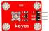
.. |image2| image:: media/becb4f4c9a6ad81cb6b88792c61e9e7e.jpg
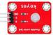
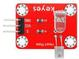
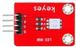
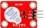
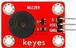
.. |image8| image:: media/0bcd6a533701dcdb846495f16ac01bbb.jpg
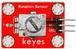
.. |image10| image:: media/ceef67cb50b0ae35b9bc8d0c4cdef47d.jpg
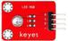
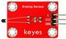
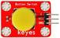
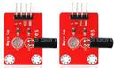
.. |image15| image:: media/bfd1437299a2f550f6ef8286ce135ea7.jpg
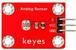
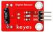
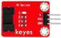
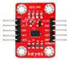
.. |image20| image:: media/6d61281d7a1c7d1d730134fc96b2e2d0.jpg
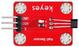
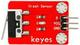
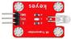
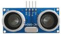
.. |image25| image:: media/b602307c221bfc4daaccd6ad1afd1ce1.jpg
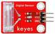
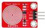
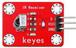
.. |image29| image:: media/3422eaffa30fb648bb2401c4143add8c.jpg
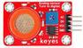
.. |image31| image:: media/4d20ab87988707e1715f69e8e5a06d0a.jpg
.. |image32| image:: media/92a0ba0a101a82290ddfcc3889e86b8f.jpg
.. |image33| image:: media/dcd02b9f029d3deabeda605a8ce0853b.jpg
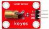
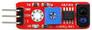
.. |image36| image:: media/96778679bdef5a7387150faab12a129e.jpg
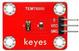

.. |image39| image:: media/becb4f4c9a6ad81cb6b88792c61e9e7e.jpg

.. |image45| image:: media/0bcd6a533701dcdb846495f16ac01bbb.jpg

.. |image47| image:: media/ceef67cb50b0ae35b9bc8d0c4cdef47d.jpg

.. |image52| image:: media/bfd1437299a2f550f6ef8286ce135ea7.jpg

.. |image57| image:: media/6d61281d7a1c7d1d730134fc96b2e2d0.jpg

.. |image62| image:: media/b602307c221bfc4daaccd6ad1afd1ce1.jpg

.. |image66| image:: media/3422eaffa30fb648bb2401c4143add8c.jpg

.. |image68| image:: media/4d20ab87988707e1715f69e8e5a06d0a.jpg
.. |image69| image:: media/92a0ba0a101a82290ddfcc3889e86b8f.jpg
.. |image70| image:: media/dcd02b9f029d3deabeda605a8ce0853b.jpg

.. |image73| image:: media/96778679bdef5a7387150faab12a129e.jpg

